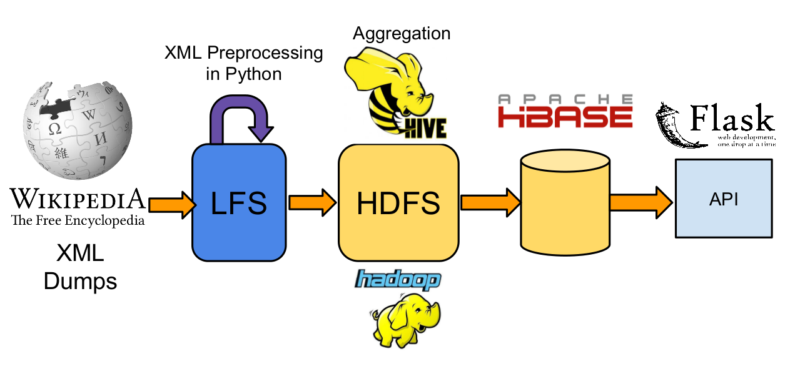

Wikihub
=======
------------

##Github-like stats for Wikipedia Pages
--------



The latest [Wikipedia XML dumps](http://dumps.wikimedia.org/enwiki/latest/) are downloaded from the Wikipedia Servers. Preprocessing is done in Python with minimal memory footprint for conversion to TSV.

The files are then put into HDFS for aggregation in Hive. Data is then inserted into Hbase through bulk loading.

A Flask API serves API requests offering statistics on a per page basis.


### Additional setup requirements

```Shell
sudo apt-get install python-pip
``` 